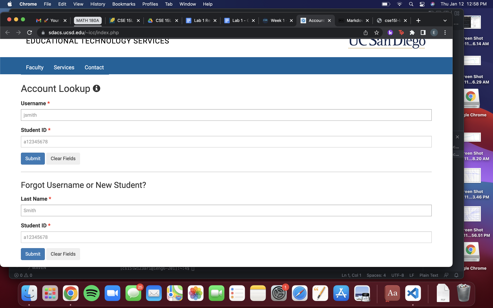

Step 1:

You would first need to look for your CSE 15L account, and in order to do that, you first need to reset your password. Wait for around 15 minutes so your account can activate.  Under Account Lookup, type in your UCSD username and student ID, and on the next page, change your password. The link below shows the Account Lookup page.

Step 2:

If you do not have Visual Studio Code, you would then need to download it. Press the download button in the top right corner, and download the program according to your type of computer. You should see something like this.

After you open Visual Studio Code, you should see something like this.

Step 3:

We can now connect your account to VS Code. Click New File, and make a new terminal. In your terminal, type in ss cs15lwi23zz@ieng6.ucsd.edu, but replace “zz” with the letters in your course specific account. Type in yes to the message that pops up, and then type in your password. If you have successfully done this, you should see this in your terminal.

Step 4:

Try to input some commands and see what happens. Here’s an example of the command ls-lat. This command is useful because it allows us to see the contents of the current working directory. It gives us a list of the files and folders of the given path. 

