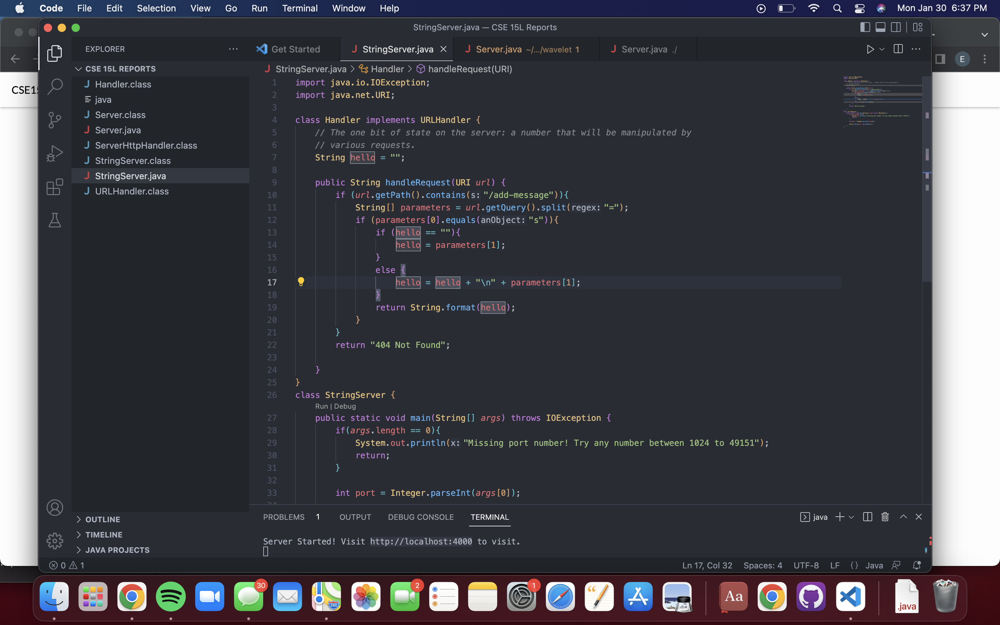
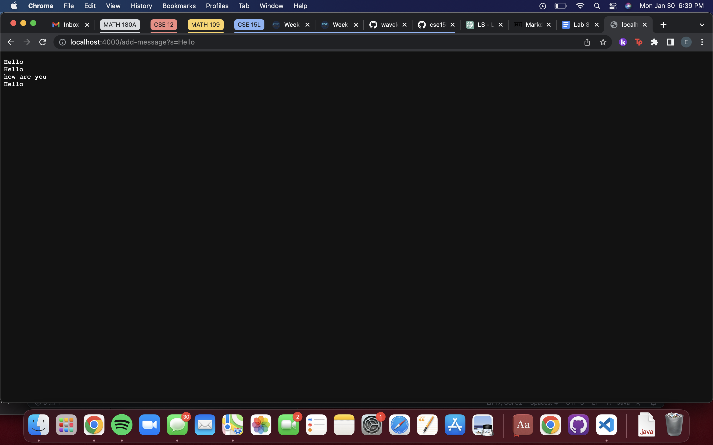
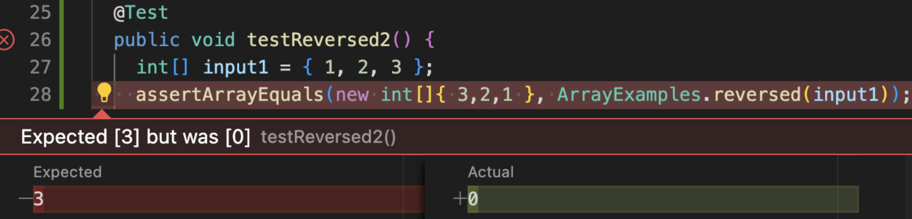

 # **Part 1**
 
 
 
 
 
 
 
 
 
 
 
 
 # **Part 2**
 
 For lab 3, a failure-inducing input for the ReverseInPlace method would be {1,2,3}. The code for these inputs is the following.
 
 # code block
 @Test
 public void testReversed(){
     int[] input = {1, 2, 3};
     ArrayExamples.reversed(input);
     assertArrayEquals(new int[]{3, 2, 1}, input);
 
 
 Its symptom is {0,0,0}. 
 
 
 
 
 An input that doesn't induce a failure would be {1}.
 ```
 # code block
 @Test
 public void testReversed(){
     int[] input = {1};
     ArrayExamples.reversed(input);
     assertArrayEquals(new int[]{1}, input);
 ```
 
 
 This would be the bug before I made the changes.
 
 
 # code block
 static int[] reversed(int[] arr){
      int[] newArray = new int[arr.length];
      for (int i = 0; i < arr.length; i++){
          arr[i] = newArray[arr.length -i -1];
          }
          return arr;
        }
 
 
 
 
 
 This is the revised code.
 
 
 
 
 
 # code block
 static int[] reversed(int[] arr){
      int[] newArray = new int[arr.length];
      for (int i = 0; i < arr.length; i++){
        newArray[i] = arr[arr.length - i -1];
      }
      return newArray;
    }
    
 This new code works because in the old code, the elements in newArray are not the same as the elements in arr. In the new code, this issue is fixed.
 
 
 # **Part 3**
 
 Something I learned from lab 3 is that you can have inputs that would not produce any errors or failures, but your code would still not completely work for other inputs. This means that I have to thoroughly test my code in order to make sure that any inputs will not break my code. 
