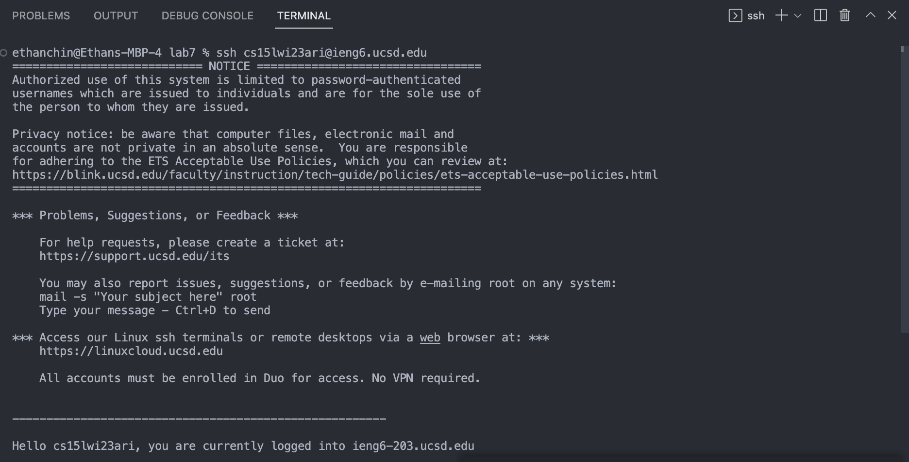
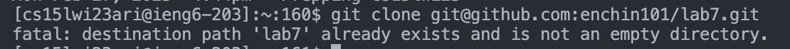
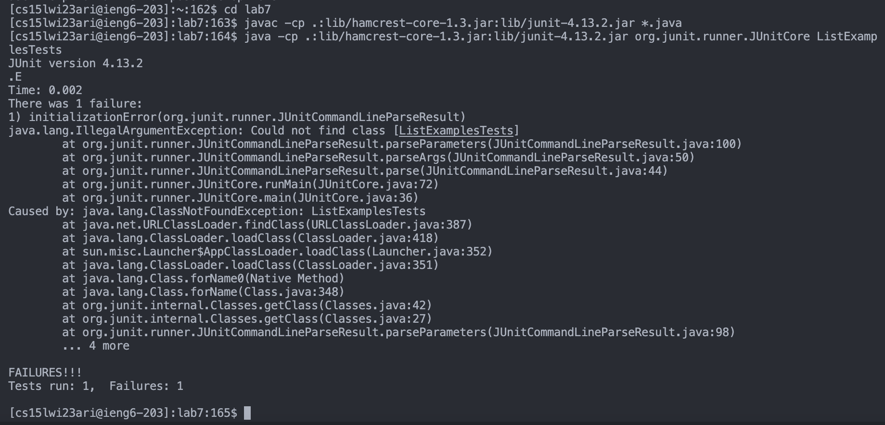

# Lab 4 Report

## Step 4
I logged onto my ieng6 account after I generated a SSH key for my account. To log in, I had to type in this.

```
ssh cs15lwi23ari@ieng6.ucsd.edu
```

This is what it looks like in VS Code.



## Step 5
I then cloned the fork of the repository from my Github account. I had to type in this.

```
git clone git@github.com:enchin101/lab7.git
```
This is what it looks like in VS Code.



## Step 6
I then ran the tests to demonstrate that the code fails. To run this, I had to type in these lines of code.

```
cd lab7
javac -cp .:lib/hamcrest-core-1.3.jar:lib/junit-4.13.2.jar *.java
java -cp .:lib/hamcrest-core-1.3.jar:lib/junit-4.13.2.jar org.junit.runner.JUnitCore ListExamplesTests
```

This is what it looks like in VS Code.



