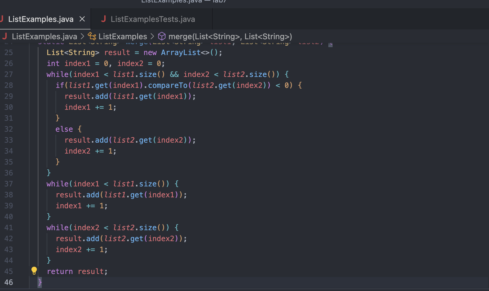
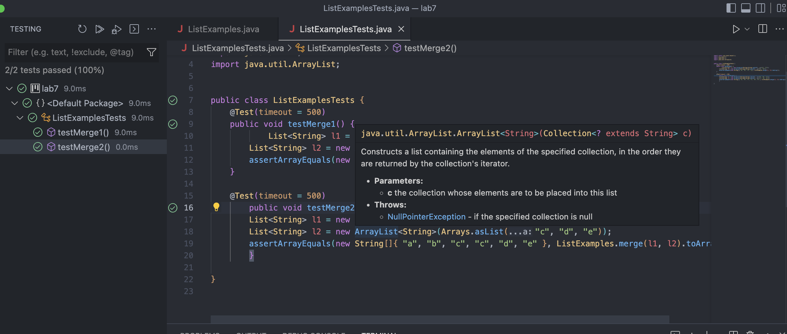
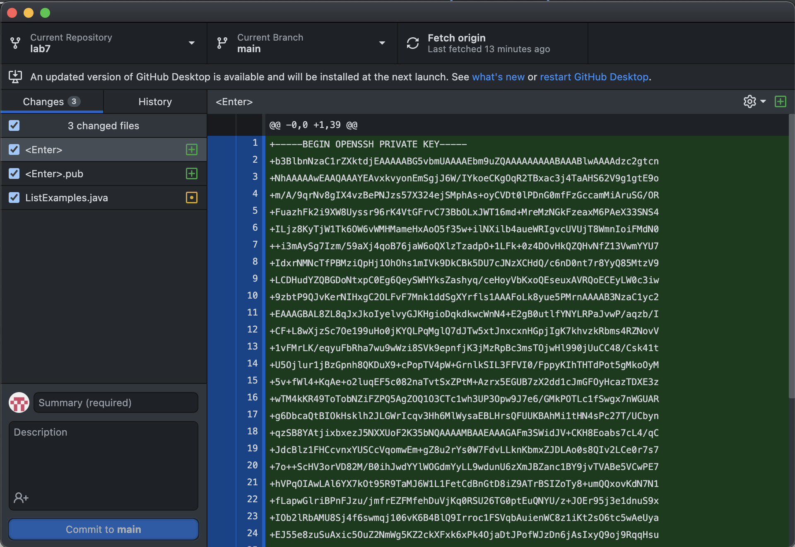

# Lab 4 Report

## Step 4
I logged onto my ieng6 account after I generated a SSH key for my account. To log in, I had to type in this.

```
ssh cs15lwi23ari@ieng6.ucsd.edu
```

This is what it looks like in VS Code.


## Step 5
I then cloned the fork of the repository from my Github account. I had to type in this.

```
git clone git@github.com:enchin101/lab7.git
```
This is what it looks like in VS Code.


## Step 6
I then ran the tests to demonstrate that the code fails. To run this, I had to type in these lines of code.

```
cd lab7
javac -cp .:lib/hamcrest-core-1.3.jar:lib/junit-4.13.2.jar *.java
java -cp .:lib/hamcrest-core-1.3.jar:lib/junit-4.13.2.jar org.junit.runner.JUnitCore ListExamplesTests
```

This is what it looks like in VS Code.


## Step 7
I then had to correct the code so that it would pass the tests. The only thing I changed was in line 43, where I changed 

```
index1 += 1
````
to this

```
index2 += 2
```

Here's what it looks like on VS Code.



## Step 8

In order to run the tests again, I pressed the up arrow twice to access this command because it was 2 up in the search history.
```
javac -cp .:lib/hamcrest-core-1.3.jar:lib/junit-4.13.2.jar *.java
```
I then pressed the down arrow once to access it was the first thing in the search history. 
```
java -cp .:lib/hamcrest-core-1.3.jar:lib/junit-4.13.2.jar org.junit.runner.JUnitCore ListExamplesTests
```
So for this test, the keys that I pressed were <up> <up> <enter>, and then <down> <enter>.

These are the passed tests on VS Code.


  
## Step 9
To commit and push the changes to my Github account, you just have to presh commit changes on your github desktop page.

Here's what it looks like.

